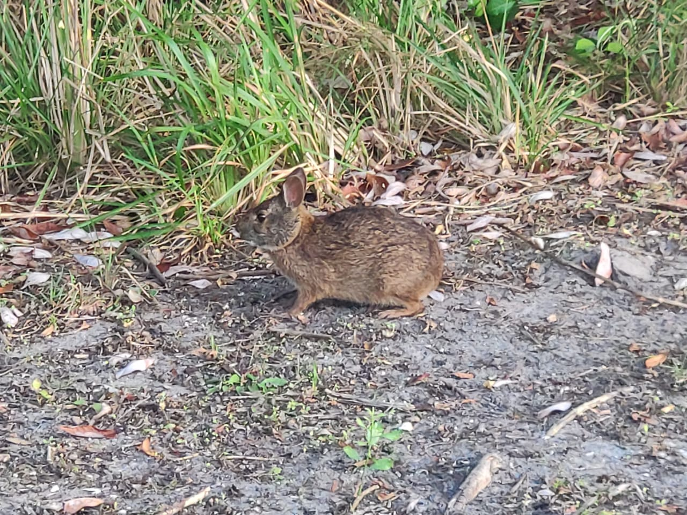

# All about me!)

## Introduction

I'm a small bunny, so called **marsh rabbit**, that lives in marshes and swamps of coastal regions, near lakes, harbours, bays and channels.

## More about me)

I am a __cottontail__ rabbit and typically *smaller* than other kinds of cottontail rabbits. Being a __*strong swimmer*__ I can be found only near regions of water. My motos are:
> - Practice makes perfect.
>
> - Think positive!

## My apperance

1. My back is:
- blackish brown or
- dark reddish
2. My belly is brownish gray.
3. My tail is brownish gray too.
4. I have got short ears and legs.
They are much smaller than that of a swamp rabbit.
1. The tail is also much reduced from the bushy tail seen in other cottontail rabbits.

---

Please see my ***photo*** below:

You can also find more information about me in the **internet**:

[Google search](https://www.google.com/)